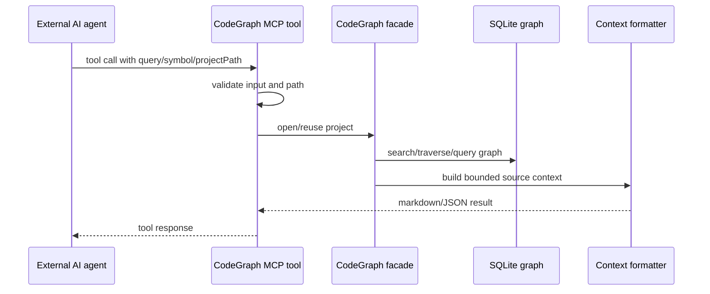

# AI Pipeline Map

Parent document: /CLAUDE.md
Related documents:
- /docs/ai/AI_SYSTEM_MAP.md
- /docs/architecture/DATA_LINEAGE.md
- /docs/security/SECURITY_MODEL.md

Read this when:
- You need the end-to-end path from agent question to CodeGraph response.
- You are tuning context output or search behavior.

Purpose:
- Describe the AI-facing context pipeline without implying internal LLM execution.

Scope:
- Includes MCP request handling, graph retrieval, formatting, and failure points.
- Excludes prompt templates and model calls; none exist in this repository.

Pipeline stages:

- Context assembly starts from graph queries, not from broad filesystem crawling.
- Source snippets are selected by graph relevance, symbol positions, flow paths, and output budgets.
- The response is formatted for agent consumption but remains deterministic source/metadata.
- Downstream usage is controlled by the external agent.

Failure points:

- No `.codegraph/` index: success-shaped guidance.
- Stale index: watcher/sync/catch-up should reduce but cannot eliminate race windows.
- Ambiguous symbols: tool may return multiple overloads/bodies.
- Missing graph edge: agent may fall back to Read/Grep.
- Over-budget output: relevant source can be truncated; output text should steer to more CodeGraph calls, not manual Read.

Known gaps / uncertainties:
- There is no persistent conversation memory or prompt-versioning system in CodeGraph itself.
