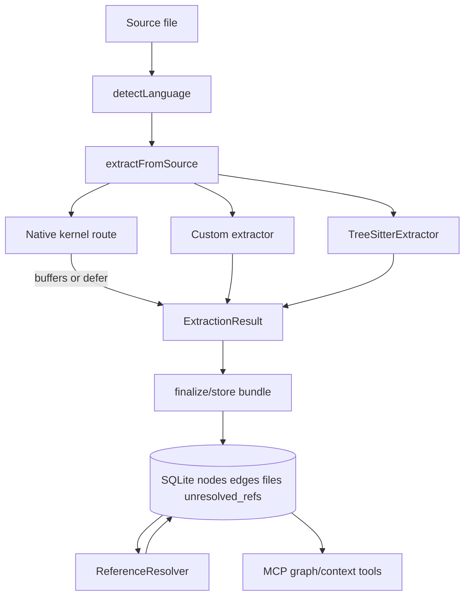

# AST Parser and Graph Build

Parent document: /CLAUDE.md
Related documents:
- /docs/architecture/DATA_CONTRACTS.md
- /docs/architecture/RUNTIME_FLOWS.md
- /docs/architecture/CALL_GRAPH.md
- /docs/architecture/DATA_LINEAGE.md
- /docs/development/TESTING_STRATEGY.md

Read this when:
- You are adding or changing a language parser.
- You are debugging why a symbol, call edge, import edge, or route is missing.
- You need to understand how source files become SQLite graph rows and MCP answers.

Purpose:
- Explain the AST parsing and graph-construction pipeline in implementation detail.

Scope:
- Includes file discovery, language detection, grammar loading, AST walking, node/ref/edge emission, native-kernel fallback, storage, resolution, synthesis, and graph consumption.
- Excludes every language-specific AST branch; read `src/extraction/languages/<language>.ts` and the matching `tree-sitter.ts` branches for the exact syntax shape.

## Mental Model

CodeGraph builds the graph in two major phases:

1. Extraction creates local facts from each file: file/symbol nodes, direct containment/direct edges, and unresolved references.
2. Resolution links those unresolved references across the complete project and adds synthesized dynamic-dispatch edges.

The parser does not need to know every target while walking one file. It should emit stable nodes and precise unresolved refs. The resolver owns cross-file target selection.

## File Discovery Before Parsing

Entry point: `ExtractionOrchestrator.indexAll` in `src/extraction/index.ts`.

The scan decides what can even reach a parser:

- Uses git-visible files when possible, including tracked and untracked files while respecting ignore rules.
- Falls back to filesystem walking when git is unavailable or unsuitable.
- Applies built-in excludes for dependency/build/cache directories.
- Handles embedded repositories, submodules, worktrees, gitignored child repos, and `codegraph.json` `include`, `exclude`, `includeIgnored`, and extension overrides.
- Rejects oversized files above `MAX_FILE_SIZE`.
- Reads files as UTF-8 source.

This matters because a parser bug is not always in the parser. A missing symbol can be caused by scan scope, extension detection, ignore rules, file size, or custom extension config before AST parsing starts.

## Language Detection and Grammar Loading

Authority: `src/extraction/grammars.ts`.

Language detection maps path/content to a `Language`:

- Extension map handles ordinary file types.
- `.h` is content-sniffed into C, C++, or Objective-C.
- Extensionless Play routes, Shopify Liquid JSON templates, and Erlang `.app/.app.src` files are special-cased.
- `codegraph.json` extension overrides can replace the built-in extension result.

Grammar loading:

- `initGrammars()` initializes `web-tree-sitter`.
- `loadGrammarsForLanguages()` loads only grammars needed by the current index set.
- Svelte/Vue/Astro expand to TypeScript/JavaScript grammars because their script blocks delegate there.
- CFML expands to CFScript/CFQuery grammars for dialect sections.
- Some grammars are vendored under `src/extraction/wasm/` because package-provided WASM is missing, stale, or must match native-kernel grammar revisions.

High-risk invariant: extension map, supported languages, and copied WASM assets must stay in sync. If a language is detected but its grammar is missing, that file emits parser errors or falls back only where a custom/file-level path exists.

## Parser Routing

Function: `extractFromSource(filePath, source, language?, frameworkNames?)` in `src/extraction/tree-sitter.ts`.

Routing order:

1. Svelte, Vue, Astro use custom extractors that parse markup and delegate script content.
2. Liquid, Razor, XML/MyBatis, CFML/CFScript, and Delphi DFM/FMX use custom extractors.
3. YAML, Twig, and properties are file-level-only at this stage.
4. Ordinary languages try the native kernel if routed and available.
5. Kernel `defer:` or failure falls back to `TreeSitterExtractor`.
6. Framework `extract()` hooks run after parser extraction and can append route nodes/references.

Routed native-kernel languages in this checkout:

- TypeScript
- TSX
- JavaScript
- JSX
- Java
- Python
- Go

Kernel controls:

- `CODEGRAPH_KERNEL=0`: disable kernel.
- `CODEGRAPH_KERNEL_LANGS=<langs|all>`: replace routed set.
- `CODEGRAPH_KERNEL_DEBUG=1`: explain kernel load/routing problems.

The kernel is an optimization and parity surface, not a separate graph model. It must emit the same `ExtractionResult` contract as the WASM path or return null and let WASM handle the file.

## TreeSitterExtractor Lifecycle

Class: `TreeSitterExtractor` in `src/extraction/tree-sitter.ts`.

Per-file lifecycle:

1. Constructor detects/stores language and selects `EXTRACTORS[language]`.
2. `extract()` validates support and gets a parser from `getParser(language)`.
3. Optional language `preParse` transforms source. It must preserve offsets.
4. `parser.parse(source)` produces the AST.
5. A `file` node is created with id `file:<path>`.
6. The file node is pushed onto `nodeStack`, making top-level symbols children of the file.
7. Java/Kotlin-style package declarations may create an implicit namespace node and push it onto scope.
8. `visitNode(rootNode)` walks the AST.
9. End-of-file flushes function-as-value references and value-reference edges.
10. The tree is deleted and source string released to reduce WASM/native memory pressure.

The extractor keeps these mutable per-file accumulators:

- `nodes`: emitted graph nodes.
- `edges`: direct graph edges, mainly containment and same-file/direct facts.
- `unresolvedReferences`: refs to resolve after full-project extraction.
- `nodeStack`: current containment/scope stack.
- language-specific state such as C++ namespace prefix, function-pointer maps, value-reference scopes, and function-ref candidates.

## LanguageExtractor Contract

Interface: `src/extraction/tree-sitter-types.ts`.

Each language file under `src/extraction/languages/` configures the shared walker:

- `functionTypes`, `classTypes`, `methodTypes`, `interfaceTypes`, `structTypes`, `enumTypes`.
- `importTypes`, `callTypes`, `variableTypes`, `fieldTypes`, `propertyTypes`.
- AST field names for `name`, `body`, `parameters`, `return`.
- Hooks for names, signatures, imports, variables, receiver types, inheritance, type refs, custom node visits, and synthesized members.

The shared walker uses those declarations in `visitNode` to dispatch syntax nodes into extraction methods. If the generic walker cannot describe a language shape, the language can provide `visitNode(node, ctx)` and handle that subtree itself.

## AST Walk Dispatch

Method: `TreeSitterExtractor.visitNode`.

The dispatch ladder is intentionally centralized:

- Custom language hook gets first chance.
- Pascal and C++ namespace handling have special branches.
- Function-as-value capture scans containers independently of normal symbol extraction.
- Function declarations become function or method nodes depending on class scope.
- Class/interface/struct/enum/type-alias/property/field/variable declarations create symbol nodes.
- Imports create import nodes and import unresolved refs.
- Re-exports create imports refs for barrel dependencies.
- Calls create `calls` unresolved refs.
- Instantiations create `instantiates` unresolved refs.
- Type annotations, inheritance, decorators, property wrappers, language-specific records/macros, and framework-adjacent constructs add `references`, `extends`, `implements`, or other refs/edges.

Most symbol extractors set `skipChildren = true` after they explicitly walk the correct body. This avoids double-counting nested symbols or calls.

## Node Creation

Method: `TreeSitterExtractor.createNode`.

Node creation does more than allocate an object:

- Drops unnamed nodes to avoid meaningless symbols and FK failures.
- Generates stable-ish ids with `generateNodeId(filePath, kind, name, startLine)`.
- Computes `qualifiedName` from `nodeStack`, package/namespace state, receiver type hooks, and language scope conventions.
- Records file path, language, range, docstring, signature, visibility, export/static/async/abstract flags, decorators, type params, and return type when available.
- Adds a `contains` edge from current scope to the new node.
- Captures value-reference targets/read scopes where enabled.

Important implication: moving a symbol line can change its id. Sync has cross-file incoming-edge reattachment logic to mitigate this for re-indexed target files.

## Scope and Qualified Names

`nodeStack` is the containment source of truth. The file node is always the root scope. Classes, modules, package namespace nodes, functions, and methods push themselves while their body is walked.

Qualified names are what search and resolution depend on. A language hook that omits receiver type or package namespace may still emit a node, but cross-file resolution and overloaded search can degrade badly.

Examples of scope-sensitive behavior:

- Go methods use receiver type.
- Java/Kotlin package declarations add namespace context.
- C++ namespaces prefix qualified names without creating namespace nodes for every block.
- Python/Ruby functions inside class-like nodes are methods.
- Swift computed properties are property nodes whose getter body is walked under the property scope.

## References vs Edges

Extraction emits two relationship forms:

- Immediate edges when both endpoints are known in the same extraction result, especially `contains`.
- Unresolved references when the target needs project-wide knowledge.

Common unresolved reference kinds:

- `calls`: a function/method call.
- `imports`: imported or re-exported symbol/file/module binding.
- `references`: type/value/decorator/property-wrapper/static-member dependency.
- `instantiates`: constructor/object creation.
- `extends` / `implements`: inheritance/conformance.
- `function_ref`: internal callback/function-as-value reference.

The resolver later turns these into concrete `edges` rows or parks them as failed refs.

Do not make parser code guess a cross-file target just because a name looks obvious. Emit a precise ref name and let the resolver apply language/import/framework rules with full graph visibility.

## Function-As-Value Capture

The parser captures callback registrations and function values that are not syntactic calls:

- Candidate names are collected during AST walk in argument lists, assignment RHS, object/array/table literals, and language-specific value containers.
- `flushFnRefCandidates()` runs after the file is fully walked.
- Candidates are gated to avoid generic local/field noise.
- Surviving candidates become `function_ref` unresolved refs.

This supports dynamic-dispatch synthesis without adding noisy edges from every identifier-like value.

## Value-Reference Edges

Value-reference support records same-file reads of important file/type-scope constants/variables in selected languages. The extractor:

- Captures target constants/variables when nodes are created.
- Captures reader scopes such as functions/methods.
- Flushes same-file `references` edges at end of file.

This is deliberately bounded and guarded. It improves impact analysis for "changing this constant affects these readers" without indexing every local variable flow.

## Native Kernel Path

Files routed through the native kernel return either decoded `ExtractionResult` objects or raw kernel buffers.

Raw buffer path:

- `parse-worker.ts` calls `tryKernelExtractRaw`.
- The result carries `kernelBuffers` and `kernelCounts`.
- The main thread can avoid materializing per-node JS objects.
- `store-worker.ts` decodes buffers at store time with `decodeExtractBuffers`.

ABI contract:

- `src/extraction/kernel/layout.ts` mirrors `codegraph-kernel/src/buffers.rs`.
- `NODE_KINDS` and `EDGE_KINDS` array order in `src/types.ts` is part of the wire format.
- ABI/kind mismatch must fallback to WASM, never misdecode.

## Storage: ExtractionResult to SQLite

Main path: `ExtractionOrchestrator.storeExtractionResult`.

Fresh DB optimized path: `StoreWriter` and `store-worker.ts`.

Storage steps:

1. Compute content hash.
2. If existing file hash matches, skip unchanged file.
3. For re-indexed files, snapshot incoming cross-file edges before deleting old file nodes.
4. Delete old file rows; cascading FKs remove old nodes/edges/refs.
5. Filter valid nodes with required identity fields.
6. Filter edges to endpoints that exist in the inserted node set.
7. Filter refs to sources that exist and denormalize `filePath` and `language`.
8. Insert nodes, edges, refs, then the file record.
9. Reattach cross-file incoming edges where a re-indexed target symbol still exists by `(filePath, kind, name)`.
10. If old incoming target vanished and metadata carries original ref details, resurrect an unresolved ref for retry.

`QueryBuilder.storeFileBundle` is the fast transaction path for a file's nodes, edges, refs, and file record. Chunked insert paths yield between chunks so a huge file cannot wedge the event loop.

## Resolution: Turning Refs Into Graph Edges

After full extraction, `CodeGraph.indexAll` reinitializes `ReferenceResolver` because framework detection and indexed file lists are only complete after storage.

Resolution flow:

1. Read pending unresolved refs.
2. Warm caches for known names/files.
3. For each ref, apply prefilters and built-in symbol exclusions.
4. Try import-aware resolution.
5. Try language-family/name/qualified/method/receiver matching.
6. Let framework resolvers claim/resolve framework-specific refs.
7. Insert resolved edges with metadata and provenance.
8. Delete resolved refs.
9. Mark unresolvable refs `failed` with name-tail data for future retry.

Post-resolution passes:

- Chained calls through conformance/supertypes.
- Deferred `this.<member>` callback refs inherited from supertypes.
- Dynamic-dispatch synthesis in `callback-synthesizer.ts`.

## Dynamic-Dispatch Synthesis

Static AST edges miss runtime indirection such as callbacks, observers, event emitters, closure collections, React render transitions, and framework dispatch.

Synthesis is a graph pass, not basic parsing:

- It scans already stored nodes/edges/refs/source windows.
- It identifies registrar/dispatcher patterns with precision gates.
- It inserts `heuristic` provenance edges with metadata naming the synthesizer and wiring site.

Rule: partial coverage is worse than none. A synthesized edge that bridges only the first hop of a flow can make agents drill into the graph and then fall back to Read. Validate end-to-end flow connection.

## Graph Consumption

MCP and CLI query paths do not reparse source. They consume:

- `nodes` and `nodes_fts` for symbol search.
- `edges` for callers/callees/impact/flow.
- `files` for staleness and language/file metadata.
- Source files on disk for final source snippets.

`src/mcp/tools.ts` adds the agent-facing layer:

- Input/path validation.
- Search/explore/node/impact budget controls.
- Success-shaped recoverable errors.
- Source windows and relationship summaries sized for model context.

## Debugging Missing Graph Facts

Use this order:

1. Was the file scanned? Check `files` table and ignore/config rules.
2. Was the language detected correctly? Check extension/content routing.
3. Was the grammar/custom/kernel path available? Try `CODEGRAPH_KERNEL=0` to compare fallback.
4. Did extraction create the expected node? Check node kind, name, qualifiedName, range.
5. Did extraction emit the expected unresolved ref? Check `unresolved_refs`.
6. Did resolution mark it failed or resolve it? Check edge rows and failed refs.
7. Is the edge present but not surfaced? Check MCP search/ranking/output budget.
8. Is it dynamic dispatch? Check synthesizer coverage and provenance.

## Adding a Language

Minimum work:

1. Add language enum only if not already present.
2. Add/verify extension detection in `grammars.ts`.
3. Add/verify grammar WASM and build-copy behavior.
4. Add a `LanguageExtractor` in `src/extraction/languages/`.
5. Register it in `src/extraction/languages/index.ts`.
6. Add branches in `tree-sitter.ts` only when the generic interface cannot express the syntax.
7. Ensure imports/calls/types/inheritance emit unresolved refs in shapes the resolver can match.
8. Add tests for node extraction, qualified names, refs, and at least one resolved edge.
9. Run search-quality probes on real repos before making product claims.

Kernel routing is a later optimization. Do not default-route a language through the native kernel until parity gates pass.

Known gaps / uncertainties:
- The shared `tree-sitter.ts` contains many language-specific branches; this doc explains the architecture, not every branch.
- Native-kernel parity details live in `/docs/design/rust-kernel-migration-plan.md`; verify current routed languages in `src/extraction/kernel/index.ts`.
- Some graph quality requires real-repo validation because synthetic tests do not expose framework/dynamic-dispatch gaps.
