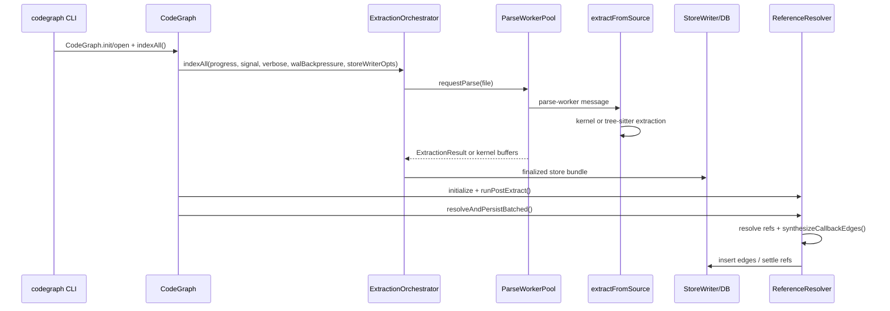

# Call Graph

Parent document: /CLAUDE.md
Related documents:
- /docs/architecture/AST_PARSER_AND_GRAPH_BUILD.md
- /docs/architecture/RUNTIME_FLOWS.md
- /docs/architecture/DEPENDENCY_GRAPH.md
- /docs/architecture/CHANGE_BLAST_RADIUS.md

Read this when:
- You need important runtime call paths from entrypoints to core modules.
- You are changing orchestration rather than a leaf helper.

Purpose:
- Capture the important call graph without dumping every function.

Scope:
- Includes primary call paths for indexing, parsing, resolution, and MCP.
- Excludes exhaustive per-command CLI paths.

## Full Index



## Parser Dispatch

```text
extractFromSource
  -> custom extractors for SFC/template/resource formats
  -> file-level-only empty extraction for yaml/twig/properties
  -> tryKernelExtract / tryKernelExtractRaw for routed languages
  -> TreeSitterExtractor fallback
       -> getParser
       -> language preParse
       -> visitNode
       -> extractFunction/class/method/import/variable/call
       -> flushFnRefCandidates
       -> flushValueRefs
  -> framework extract hooks
```

## MCP Tool Call

```text
MCPServer.start
  -> direct/proxy/daemon mode
  -> MCPEngine / MCPSession
  -> ToolHandler.execute
  -> CodeGraph open/reuse
  -> search/graph/context methods
  -> bounded MCP response
```

## Resolution Call Path

```text
ReferenceResolver.resolveAndPersistBatched
  -> warmCachesYielding
  -> read pending unresolved refs
  -> resolveBatchYielding / ResolverPool
  -> resolveOneTimed
  -> import resolver / name matcher / framework resolver
  -> insert resolved edges
  -> delete resolved refs
  -> mark unresolved refs failed
  -> synthesizeCallbackEdges
  -> resolveChainedCallsViaConformance
  -> resolveDeferredThisMemberRefs
```

Known gaps / uncertainties:
- CLI command call graph is intentionally summarized; inspect `src/bin/codegraph.ts` before changing command UX.
