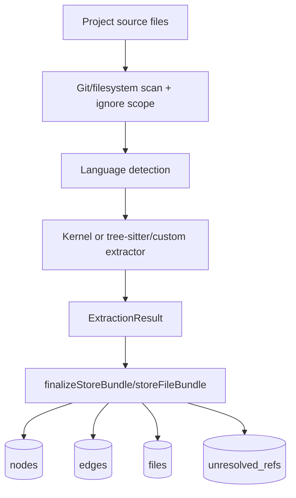
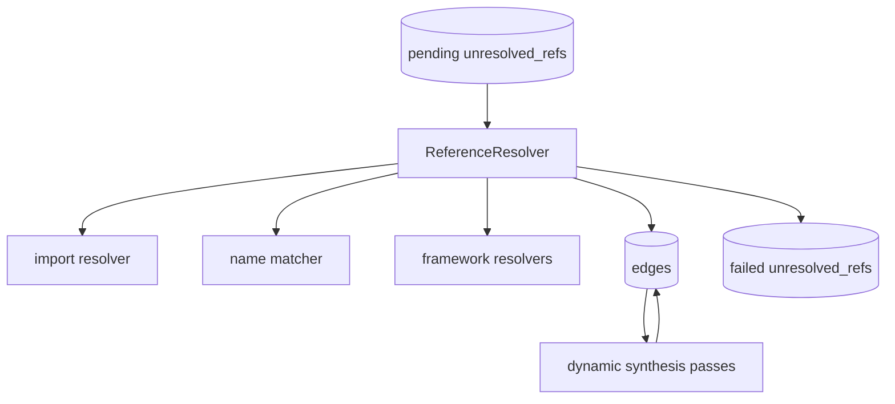
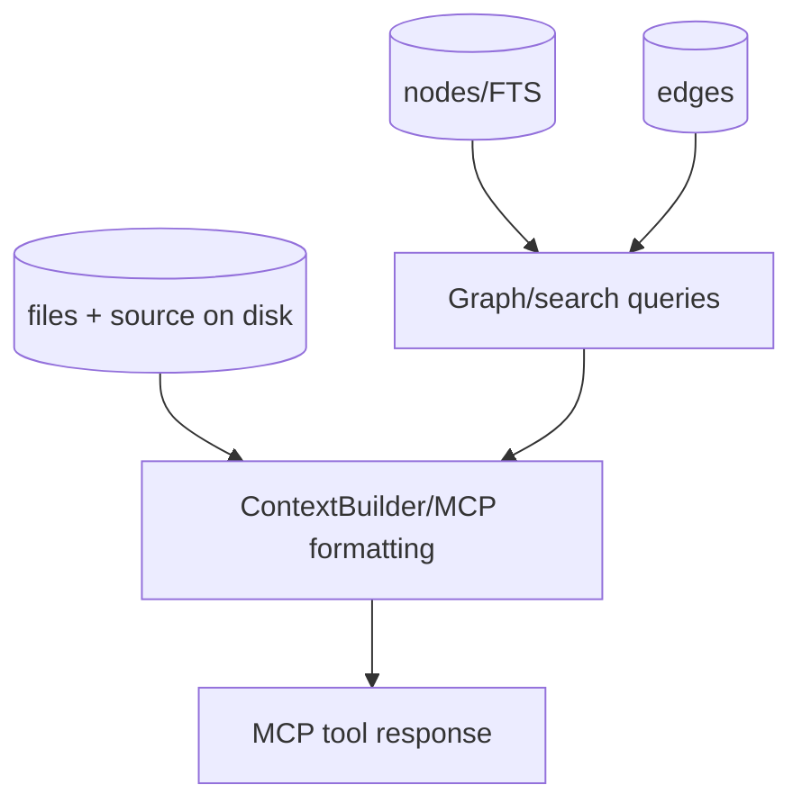

# Data Lineage

Parent document: /CLAUDE.md
Related documents:
- /docs/architecture/AST_PARSER_AND_GRAPH_BUILD.md
- /docs/architecture/DATA_CONTRACTS.md
- /docs/architecture/RUNTIME_FLOWS.md
- /docs/security/TRUST_BOUNDARIES.md

Read this when:
- You need to trace where graph data comes from and where it is consumed.
- You are changing schemas, extraction output, or MCP result formatting.

Purpose:
- Document the origin, transformations, storage, and consumption of key data.

Scope:
- Includes source files, graph rows, unresolved refs, synthesized edges, MCP output, and telemetry.
- Excludes every query method implementation.

## Source To Graph

## References To Resolved Edges

## Graph To Agent Output

Key lineage rules:

- File records use content hash and modified time for staleness decisions.
- Parser-generated unresolved refs do not include final targets; target choice is resolver-owned.
- Framework extractors may add route nodes and refs after the parser pass.
- Synthesized dynamic-dispatch edges are stored as `provenance='heuristic'` with metadata explaining the synthesizer/wiring.
- MCP output includes source from disk/graph coordinates, not LLM-generated summaries.
- Telemetry records command/event metadata only after consent; it is not used to build graph answers.

Known gaps / uncertainties:
- Source files can change during an MCP response; watcher/sync/catch-up reduce staleness but do not make source reads transactional with SQLite.
