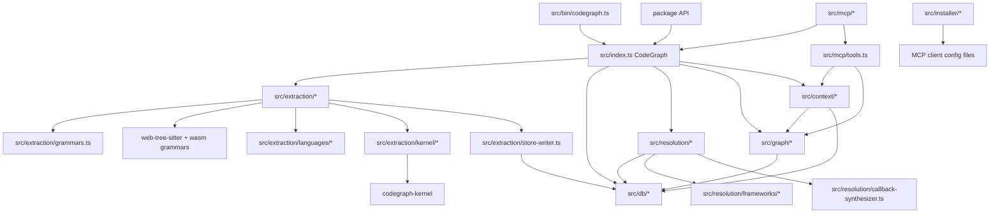

# Dependency Graph

Parent document: /CLAUDE.md
Related documents:
- /docs/architecture/RUNTIME_FLOWS.md
- /docs/architecture/CALL_GRAPH.md
- /docs/integrations/EXTERNAL_INTEGRATIONS.md

Read this when:
- You need module-level dependencies and hidden coupling.
- You are assessing change blast radius.

Purpose:
- Show how core modules depend on each other at runtime.

Scope:
- Includes internal dependency relationships and selected external dependencies.
- Excludes full import listings.

Important dependency chains:

- Parser contract chain: `LANGUAGES`/`NODE_KINDS`/`EDGE_KINDS` in `src/types.ts` -> kernel layout -> Rust buffers -> decoder -> SQLite writes.
- Language support chain: extension map -> grammar WASM availability -> extractor config -> unresolved ref shapes -> resolver/name matcher.
- Flow sufficiency chain: extraction emits refs -> resolver creates edges -> synthesizer closes dynamic gaps -> MCP explore surfaces flow.
- Fresh-index performance chain: parse worker count -> kernel routing -> store worker/window -> SQLite WAL/checkpoint settings -> resolution batching.
- Agent behavior chain: MCP initialize instructions/tool schemas -> tool output shape -> bounded source completeness -> agent stops or falls back to Read/Grep.

Hidden coupling:

- `src/extraction/kernel/layout.ts` and `codegraph-kernel/src/buffers.rs` are not just similar; they are one ABI.
- `src/types.ts` array order is a runtime wire contract for kernel indexes.
- `src/extraction/tree-sitter.ts` unresolved reference names must match `src/resolution/name-matcher.ts` and framework resolvers.
- `src/extraction/grammars.ts` extension detection controls which extractor receives a file; a wrong language routes to the wrong AST assumptions.
- `src/mcp/tools.ts` budget choices affect measured product value because agents fall back to native tools when output is insufficient.

Known gaps / uncertainties:
- Some dependency details are dynamic through `require` and lazy imports; use source grep before making build-splitting changes.
