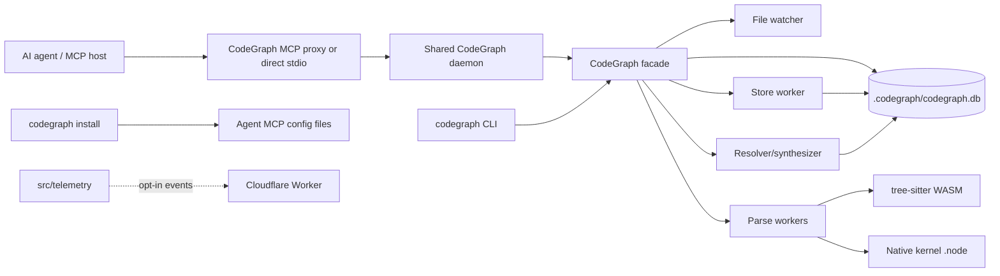

# Service Topology

Parent document: /CLAUDE.md
Related documents:
- /docs/architecture/RUNTIME_FLOWS.md
- /docs/integrations/EXTERNAL_INTEGRATIONS.md
- /docs/security/TRUST_BOUNDARIES.md

Read this when:
- You need component boundaries and data/control flow.
- You are changing MCP daemon, installer, telemetry, or runtime topology.

Purpose:
- Show the runtime components and their boundaries.

Scope:
- Includes local processes, local storage, external clients, and optional telemetry.
- Excludes deployment packaging details; see /docs/operations/DEPLOYMENT.md.

Component boundaries:

- Agent/MCP host is external and untrusted for paths/input.
- MCP proxy is short-lived per client; daemon is shared and long-lived.
- `.codegraph/` is per-project local state and includes DB, locks, daemon socket/pipe metadata, and logs.
- Parse workers isolate CPU-heavy WASM/native parsing from the main event loop.
- Store worker is fresh-DB bulk-index optimization only.
- Telemetry is optional and separate from graph correctness.

Known gaps / uncertainties:
- Host-specific MCP process launch behavior varies; Cursor has documented cwd/root quirks.
