# Operational Failure Graph

Parent document: /CLAUDE.md
Related documents:
- /docs/operations/FAILURE_MODES.md
- /docs/architecture/RUNTIME_DEPENDENCY_TREE.md
- /docs/security/TRUST_BOUNDARIES.md

Read this when:
- You need failure propagation paths.

Purpose:
- Show how dependency failures affect user-visible behavior.

Scope:
- Includes local dependency failure propagation.
- Excludes hosted service incidents.

```mermaid
graph TD
  NodeBad[Unsupported Node / Node 25] --> CLIBlock[CLI exits before parsing]
  SchemaMissing[Missing dist schema.sql] --> DBInitFail[DB init/open failure]
  WasmMissing[Missing grammar WASM] --> ParseErrors[Language parse unavailable]
  KernelBad[Kernel ABI/load failure] --> WasmFallback[WASM fallback]
  WasmFallback --> SlowerIndex[Slower but correct index]
  ParserOOM[Parser worker OOM] --> WorkerRestart[Worker restart/retry]
  WorkerRestart --> FileError[Per-file error or retry success]
  DBLocked[SQLite writer lock] --> IndexFail[Index/sync write failure]
  DBLocked --> MCPReadStale[MCP may serve old graph]
  ResolverBug[Resolver false negative] --> MissingEdges[Flow gaps]
  ResolverFP[Resolver false positive] --> WrongEdges[Incorrect flow answers]
  DaemonFail[Daemon socket/lock failure] --> DirectMode[Direct MCP fallback]
  DirectMode --> MoreStartupCost[Less sharing / slower attach]
  WatcherMiss[Watcher miss/race] --> StaleIndex[Stale graph until sync]
  TelemetryDown[Telemetry endpoint down] --> NoRuntimeImpact[Graph operation unaffected]
```

Known gaps / uncertainties:
- Queue services are not part of this local system; parser/store workers are local threads, not external queues.
